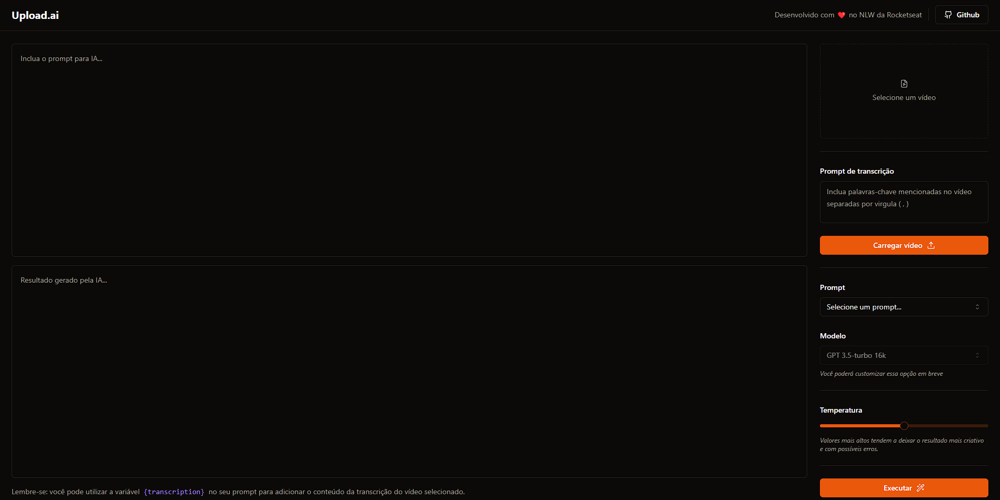

## Upload.ai

### Projeto desenvolvido na NLW AI com a Rocketseat

Upload AI, é uma ferramenta de upload de vídeos para o Youtube que cria automaticamente títulos, descrições e materiais para vídeo.

